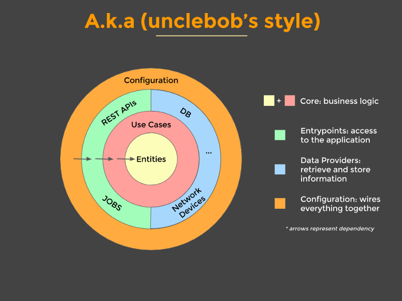

# Spring boot cleanarch

Repository containing two simple Spring Boot applications that each follows Uncle Bob's Clean Architecture project architecture. The objective of this repository is simple: To learn about Clean Architecture and how to built scalable, maintanable and testable application with it.

## Features

- Create, read, update, and delete records
  
- Store information in H2/ MongoDB database

## Architecture

The applications in this repository are built using Spring Boot and following the Clean Architecture, a design pattern that is composed of several layers, each with its own distinct responsibilities. Here’s a brief overview of each layer:



- `Entities/ Domain Objects`: This layer represents the core business objects or concepts that the application is concerned with. It contains the business rules and logic that define the behavior of the application.

- `Use Cases`: This layer represents the specific actions or operations that can be performed on the entities. It contains the application-specific business rules and logic that define how the entities are used.

- `Interfaces/ Data Provider`: This layer defines how the domain layer interacts with the other layers of the application, such as the presentation and infrastructure layers. It contains the interfaces that the other layers use to communicate with the domain layer.

- `Infrastructure/ Entrypoint`: This layer represents the implementation details of the application, such as the database, file system, or external services. It contains the concrete implementations of the interfaces defined in the domain layer.

### Advantages of using Clean Architecture

- `Improved maintainability`: Clean Architecture promotes modularity, testability, and maintainability by separating the domain layer from the other layers of the application.

- `Loose coupling of components`: Clean Architecture is loosely coupled to the externals you want to use because of the layer of the adapters. This makes it easier to test, develop, and maintain the code of the application.

- `Improved flexibility`: Clean Architecture makes it easier to reuse components in other projects.

- `Improved testability`: Clean Architecture makes it easier to test and debug the code, as each layer can be tested independently and mocked as needed. The domain layer does not depend on any external frameworks or libraries, making it easy to write unit tests for the business logic.
  
- `Improved team productivity`: Clean Architecture improves team productivity by allowing different developers to work on different layers of the application without interfering with each other. The clear separation of concerns and the use of interfaces make it easier to collaborate and integrate the code.
  
- `Improved security`: Clean Architecture improves security by limiting the exposure of the domain layer to the other layers of the application. The domain layer contains the most sensitive and critical data and logic of the application, and by isolating it from the infrastructure layer, it reduces the risk of data breaches or unauthorized access.

## Getting Started

### Prerequisites

- Java 17 or higher
- Maven

### Installation

1. Clone the repository
git clone https://github.com/athirsonsilva/spring-boot-cleanarch.git


2. Change to project directory

```bash
cd spring-boot-cleanarch
```

3. How to run the applications

   1. To run `cleanarch-from-ntier` application, change to its directory and run
     
   ```bash
   ./mvnw spring-boot:run
   ```

   2. To run `cleanarch-from-scratch` application, change to its directory and run
     
   ```bash
   ./gradlew bootRun
   ```

The application will start and be available at `http://localhost:8080`. When accessing the address, you will see the Swagger UI documentation screen.
